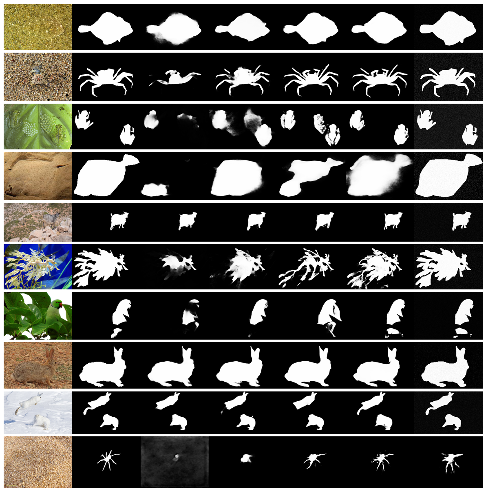

# diff-ssm
the code will be released after this paper accepted.
# Fast-CamoDiff: A Fast Inference Diffusion Model for Camouflaged Object Detection

This repository contains the official implementation of "Fast-CamoDiff: A Fast Inference Diffusion Model for Camouflaged Object Detection".

## Overview

Fast-CamoDiff is a novel diffusion-based paradigm for Camouflaged Object Detection (COD) that achieves comparable accuracy to state-of-the-art models while significantly reducing computational overhead. 

Fast-CamoDiff consists of three main components:
1. Dynamic Encoding Mechanism for adaptive processing
2. Asynchronous Denoising Paradigm with region-specific parameters
3. Diff-SSM blocks with bidirectional pooling layers

## Results

### Comprehensive Performance Comparison
| Category | Method | Pub. | GFLOPs | Param. | CAMO |||||  COD10K |||||  NC4K |||||
|:--:|:--:|:--:|:--:|:--:|:--:|:--:|:--:|:--:|:--:|:--:|:--:|:--:|:--:|:--:|:--:|:--:|:--:|:--:|:--:|
| | | | | | FPS↑ | Sα↑ | Fβ↑ | Eφ↑ | MAE↓ | FPS↑ | Sα↑ | Fβ↑ | Eφ↑ | MAE↓ | FPS↑ | Sα↑ | Fβ↑ | Eφ↑ | MAE↓ |
| CNN | ANet | 19' | 14.56 | 22.27M | 36 | .682 | .685 | .792 | .126 | - | - | - | - | - | - | - | - | - | - |
| | SINet V2 | 21' | 12.28 | 26.98M | 39 | .822 | .827 | .864 | .070 | 38 | .815 | .819 | .859 | .037 | 37 | .847 | .852 | .885 | .048 |
| | C²FNet | 22' | 13.12 | 28.41M | 43 | .796 | .802 | .856 | .080 | 41 | .813 | .817 | .862 | .036 | 40 | .838 | .843 | .878 | .049 |
| | PFNet | 21' | 26.54 | 46.5M | 58 | .782 | .789 | .840 | .085 | 57 | .800 | .805 | .852 | .040 | 55 | .829 | .834 | .873 | .053 |
| | Zoom-Net | 22' | 203.5 | 32.28M | 40 | .820 | .825 | .868 | .066 | 39 | .838 | .842 | .879 | .029 | 37 | .853 | .858 | .889 | .043 |
| | ZoomNeXt | 24' | 185.8 | 28.46M | 28 | .833 | .838 | .875 | .040 | 27 | .885 | .889 | .912 | .017 | 26 | .903 | .908 | .925 | .028 |
| | DINet | 24' | 112.2 | 30.09M | 38 | .821 | .826 | .869 | .068 | 37 | .832 | .837 | .876 | .031 | 36 | .856 | .861 | .893 | .043 |
| | BGNet | 22' | 58.6 | 42.61M | 44 | .813 | .819 | .862 | .073 | 43 | .831 | .836 | .874 | .033 | 41 | .851 | .856 | .888 | .044 |
| | MirrorNet | 20' | 52.9 | 50.42M | 26 | .784 | .791 | .843 | .077 | - | - | - | - | - | - | - | - | - | - |
| | FPNet | 23' | 44.2 | 29.49M | 31 | .853 | .858 | .882 | .056 | 30 | .850 | .855 | .885 | .028 | - | - | - | - | - |
| | MRRNet | 23' | 18.67 | 53.97M | 82 | .811 | .816 | .860 | .076 | 81 | .822 | .827 | .868 | .036 | 79 | .848 | .853 | .886 | .049 |
| Trans | CamoFormer | 24' | 99.2 | 99.41M | 17 | .817 | .823 | .866 | .067 | 16 | .838 | .843 | .879 | .029 | 15 | .855 | .860 | .891 | .042 |
| Diff | DiffCOD | 23' | 1770 | 82.25M | 7 | .795 | .801 | .854 | .082 | 7 | .812 | .817 | .862 | .036 | 6 | .893 | .898 | .918 | .030 |
| | CamoDiff | 24' | 983 | 59.01M | 12 | .871 | .876 | .892 | .042 | 12 | .883 | .888 | .908 | .019 | 11 | .895 | .900 | .920 | .028 |
| | **Ours** | - | **317** | **36.5M** | **28** | **.870** | **.875** | **.891** | **.035** | **27** | **.889** | **.894** | **.912** | **.014** | **28** | **.908** | **.913** | **.929** | **.025** |

*Notes: The best results are shown in bold. "-" indicates no available results.*
#### Qualitative Results

*Visual comparison on challenging cases from different datasets. From left to right: Input image, Ground Truth, Previous SOTA methods, and Our results.*
### Key Features

- **High Efficiency**: Only 36.5M parameters (67.4% reduction compared to previous SOTA)
- **Fast Inference**: Achieves 28 FPS on RTX 4090 (52.7% faster than previous SOTA)
- **Strong Performance**: Maintains competitive accuracy across all metrics
- **Novel Architecture**: Integrates SSM modules with bidirectional pooling for enhanced feature extraction

## License

This project is released under the MIT License.
