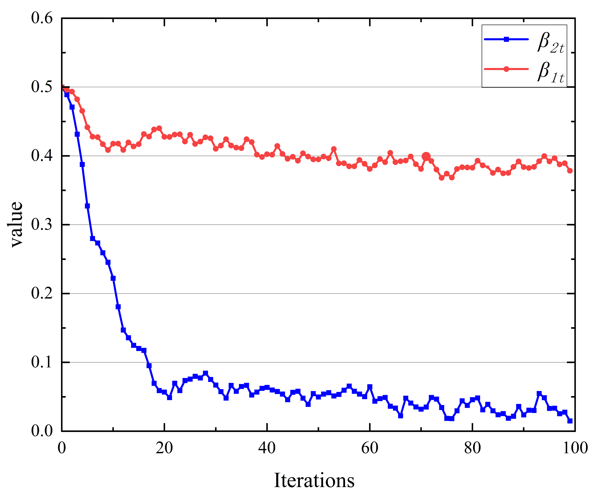

# Appendix: Parameter Sensitivity Analysis

In this appendix, we present detailed sensitivity analyses of the key parameters γ and β_t on model performance, demonstrating the robustness and effectiveness of our approach across various parameter configurations.

## Parameters Sensitive Analysis

### Sensitivity Analysis of γ₁ and γ₂

To evaluate the robustness and effectiveness of our early termination mechanism, we conduct sensitivity analysis on the threshold parameters γ₁ and γ₂. The following table shows the performance metrics in different combinations of parameters.

**Table 1: Sensitivity analysis of γ₁ and γ₂ parameters on CAMO dataset**

| γ₁ | γ₂ | S_α↑ | MAE↓ | FPS↑ | Iterations |
|---|---|---|---|---|---|
| 1e-5 | 1e-3 | 0.868 | 0.038 | 25 | 142 |
| 1e-5 | 1e-4 | 0.869 | 0.037 | 23 | 156 |
| 1e-5 | 1e-5 | 0.867 | 0.039 | 21 | 178 |
| **1e-4** | **1e-3** | **0.870** | **0.035** | **28** | **120** |
| 1e-4 | 1e-4 | 0.868 | 0.037 | 26 | 133 |
| 1e-4 | 1e-5 | 0.867 | 0.038 | 25 | 138 |
| 1e-3 | 1e-3 | 0.865 | 0.041 | 29 | 108 |
| 1e-3 | 1e-4 | 0.864 | 0.042 | **31** | 102 |
| 1e-3 | 1e-5 | 0.863 | 0.043 | 30 | 105 |

*Bold values indicate optimal performance*

#### Key Findings

Our analysis reveals several key findings:

1. **Optimal Configuration**: The combination of γ₁=10⁻⁴ and γ₂=10⁻³ achieves the optimal balance between accuracy and efficiency, with the highest S_α of 0.870, lowest MAE of 0.035, and competitive 28 FPS. This configuration requires only 120 denoising steps, demonstrating effective early termination without compromising detection quality.

2. **Robustness**: The results show consistent performance across a wide range of parameter values, with S_α varying by less than 1% (0.863-0.870) and MAE by 0.008 (0.035-0.043) across all combinations. This stability indicates the robustness of our early termination mechanism.

3. **Trade-off Analysis**: While smaller γ values generally provide better accuracy (as seen in combinations with γ₁=10⁻⁵), they require more denoising steps (142-178 steps), resulting in lower inference speed.

4. **Asymmetric Design**: The asymmetric setting of γ₁ < γ₂ proves optimal, validating our design principle that object regions require more precise convergence criteria than background regions. The order of magnitude difference between γ₁ and γ₂ (10⁻⁴ vs 10⁻³) allows for more stringent quality control in object regions while enabling faster termination in background areas.

5. **Critical Threshold**: When γ₁ becomes too large (10⁻³), the detection accuracy degrades noticeably despite achieving higher FPS, indicating a critical threshold for maintaining detection quality.

These findings demonstrate that our early termination mechanism provides stable and efficient performance across a broad range of parameter settings, with the selected default values (γ₁=10⁻⁴, γ₂=10⁻³) offering an optimal trade-off between accuracy and speed while adhering to the principle of differential convergence requirements between object and background regions.

### Sensitivity Analysis of β₁,t and β₂,t

The superior performance of our method can be attributed to its ability to rapidly and precisely identify object regions during iterative denoising through the dynamic adjustment of β₁,t and β₂,t. As illustrated in the figure below, these parameters are initially set to 0.5. During inference, their values evolve in response to the emerging distinctions between background and object regions.

*Figure 1: β₁,t and β₂,t evolution in Diff-SSM*

#### Parameter Evolution

The figure demonstrates that within the first 20 iterations, β₁,t and β₂,t decrease substantially to approximately 0.4 and 0.075, respectively, indicating successful object region identification. Subsequently, these distinct denoising thresholds govern the separate processing of object and background regions. As object region determination progresses and its area diminishes, the computational burden for background processing decreases correspondingly, leading to accelerated denoising. The parameters ultimately converge to stable values of approximately 0.4 and 0.075 for β₁,t and β₂,t, respectively.

#### Initial Value Impact

The following table demonstrates the significance of appropriate initial values for β₁,t and β₂,t during inference:

**Table 2: β₁,t and β₂,t initial value comparison**

| Initial Value | 0-40 | | 40-80 | | 80-120 | | 120-160 | | 160-200 | | Iterations |
|---|---|---|---|---|---|---|---|---|---|---|---|
| | β₁,t | β₂,t | β₁,t | β₂,t | β₁,t | β₂,t | β₁,t | β₂,t | β₁,t | β₂,t | |
| 0.8 | 0.730 | 0.362 | 0.551 | 0.529 | 0.426 | 0.307 | 0.414 | 0.064 | 0.405 | 0.208 | 209 |
| 0.7 | 0.648 | 0.343 | 0.500 | 0.495 | 0.489 | 0.320 | 0.452 | 0.155 | 0.436 | 0.174 | 183 |
| 0.6 | 0.564 | 0.301 | 0.486 | 0.142 | 0.424 | 0.105 | 0.405 | 0.082 | - | - | 135 |
| **0.5** | **0.451** | **0.240** | **0.433** | **0.088** | **0.381** | **0.049** | **-** | **-** | **-** | **-** | **120** |
| 0.4 | 0.382 | 0.219 | 0.370 | 0.125 | 0.366 | 0.107 | 0.357 | 0.099 | - | - | 149 |
| 0.3 | 0.359 | 0.202 | 0.331 | 0.185 | 0.320 | 0.132 | 0.322 | 0.116 | 0.307 | 0.094 | 176 |
| 0.2 | 0.358 | 0.098 | 0.332 | 0.082 | 0.305 | 0.091 | 0.314 | 0.085 | 0.339 | 0.088 | 215 |

*Bold values indicate optimal performance*

#### Analysis of Initial Values

With an initial value of 0.5, Diff-SSM efficiently completes the denoising process within 120 iterations. The analysis reveals:

- **Higher initial values** (0.8, 0.7) cause β₂,t to rapidly decrease during the first 20 iterations but subsequently exhibit instability, maintaining elevated computational costs per iteration.

- **Lower initial values** (0.2, 0.3) result in static β₁,t and β₂,t values, compromising the algorithm's ability to differentiate between object and background regions. This not only fails to reduce computational overhead but also results in poorly defined mask contours with significant blur.

- **Optimal initial value** (0.5) provides the best balance, allowing for efficient convergence while maintaining clear object-background differentiation.

## Conclusion

The sensitivity analysis demonstrates that our method is robust across various parameter configurations while maintaining optimal performance with carefully selected default values. The dynamic adjustment mechanism for β₁,t and β₂,t, combined with the early termination strategy using γ₁ and γ₂, provides an effective solution for balancing accuracy and computational efficiency in diffusion-based object detection.